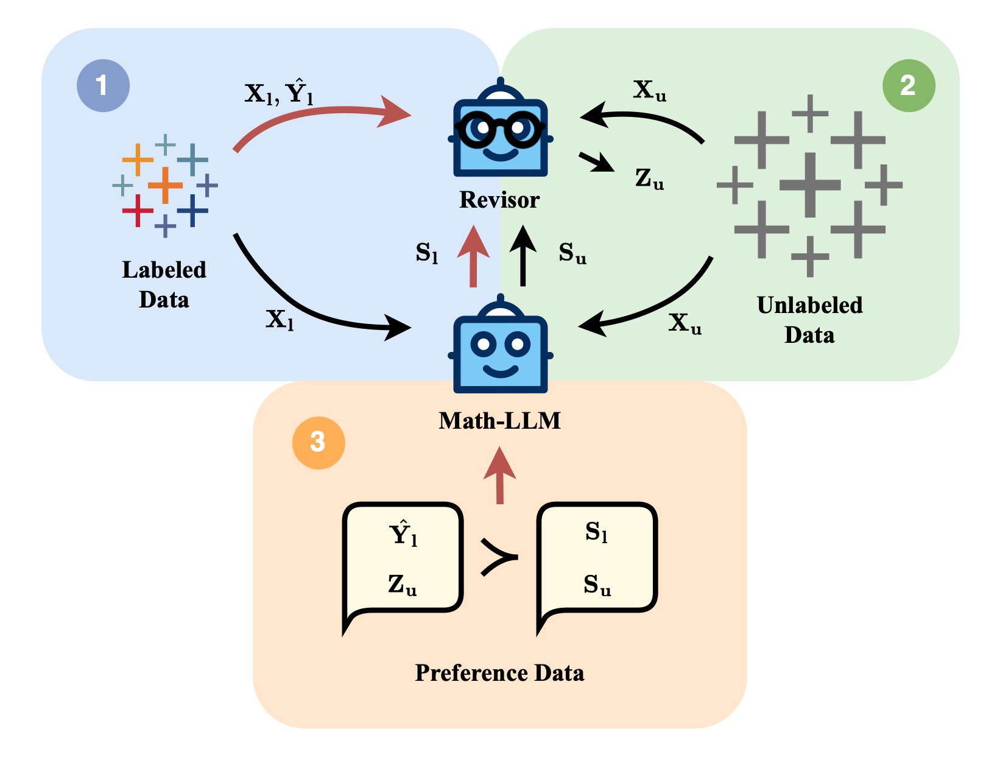

Hi! I'm Siwei Han(韩偲蔚), a senior at Fudan University, Computer Science and Technology Department. I am interested in alignment and application of LLMs, VLMs and multimodal models, currently interning in [Prof. Huaxiu Yao](https://www.huaxiuyao.io)'s team at UNC.

---

# 📝 Publications 
†: Equal contribution

ICML 2024

In this paper, we propose a novel comparison-based CoT generation algorithm that directly identifies the most promising thoughts with the noisy feedback from the LLM. In each round, we randomly pair intermediate thoughts and directly prompt the LLM to select the more promising one from each pair, allowing us to identify the most promising thoughts through an iterative process. To further model the noise in the comparison, we resort to the techniques of ensemble and dueling bandits and propose two variants of the proposed algorithm.

[Generating Chain-of-Thoughts with a Direct Pairwise-Comparison Approach to Searching for the Most Promising Intermediate Thought](https://arxiv.org/abs/2402.06918) 
Zhen-Yu Zhang, **Siwei Han**, Huaxiu Yao, Gang Niu, Masashi Sugiyama

Preprint

In this paper, we introduce MMIE, a robust, knowledge-intensive benchmark to evaluate interleaved multimodal comprehension and generation in LVLMs. With 20K+ examples covering 12 fields and 102 subfields, including mathematics, coding, physics, literature, health, and arts. It supports both interleaved inputs and outputs, offering a mix of multiple-choice and open-ended question formats to evaluate diverse competencies. Moreover, we propose a reliable automated evaluation metric, leveraging a scoring model fine-tuned with human-annotated data and systematic evaluation criteria, aimed at reducing bias and improving evaluation accuracy. We publicly release our benchmark and code on [MMIE](https://mmie-bench.github.io).

[MMIE: Massive Multimodal Interleaved Comprehension Benchmark for Large Vision-Language Models](https://arxiv.org/abs/2410.10139) 
Peng Xia†, **Siwei Han†**, Shi Qiu†, Yiyang Zhou, Zhaoyang Wang, Wenhao Zheng, Zhaorun Chen, Chenhang Cui, Mingyu Ding, Linjie Li, Lijuan Wang, Huaxiu Yao

# 📖 Educations

&emsp; [Fudan University](https://www.fudan.edu.cn/en/)    
&emsp; Undergraduate student in Computer Science and Technology. *2021.09 - now* **GPA: 3.52/4**

&emsp; [University of North Carolina at Chapel Hill](https://www.unc.edu/)    
&emsp; Exchange student. *2023.08 - 2023.12* **GPA: 3.89/4**
  

---

# 💼 Internships

&emsp; [Advantest, China](https://www.advantest.com/)    
&emsp; R&D Associate Engineer. *2024.01 - 2024.05*
  

---

# 💻 Projects
### [LLM Reviser](https://github.com/Lillianwei-h/weak_aligner) Mar. 2024 - Jun. 2024
Leverage a reviser model to enhance the quality of the response from the original LLM and further preference tuning the LLM with the LLM-generated responses as dispreferred answers and the revised answers as preferred answers.

### [THSH shell](https://github.com/Lillianwei-h/Comp-530/tree/lab1) Oct. 2023
This shell can run standard linux shell commands. It also supports creating new built-in commands. It
includes features like pipelines, input/output redirection, script input, and debugging.

### [LLMEVAL - Fudan University’s NLP Laboratory](http://www.llmeval.com/) Apr. 2023 - Jun. 2023
Designing questions and evaluation criteria for assessing large language models' capability of solving questions in Chinese. Mainly resiponsible for story generation and paragraph edition parts.
  

---

# 🗺️ Languages
- Chinese: Native
- English: TOEFL 110
- Japanese: Elementary
  

---

# 🌟 Interests
- 🎨 Drawing illustration and manga(some of my paintings⬇)
  
  
  
  <!--  -->

- 🎹 Improvisational piano playing and piano recomposition
- 🎮 Games
  - Baldur's Gate 3
  - Divinity: Original Sin 2
  - The Legend of Zelda: Breath of the Wild
  - The Elder Scrolls V: Skyrim
  - ...
- 🎶 Musicals
  - The Phantom of the Opera
  - Elisabeth
  - Dracula
  - ...
- 🐈 Kitty!
   
  

  

---

# 📊 Statistics

